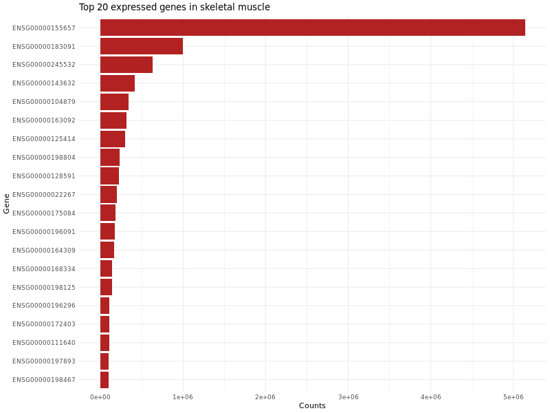

# 🧬 Bulk RNA-seq Workflow (Learning Project) for skeletal muscle

This is a **learning project**, where I built a complete RNA-seq pipeline from raw FASTQ files to gene counts.  
The goal was to practice all key steps of RNA-seq analysis and explore the expression profile of **human skeletal muscle**.

---

## 🚀 Pipeline steps

1. **Download data** – [`scripts/00_download_data.sh`](scripts/00_download_data.sh)  
   Download raw FASTQ files from SRA using `prefetch` and `fasterq-dump`.  
   Download the GRCh38 reference genome (FASTA) and annotation (GTF).

2. **Quality control** – [`scripts/01_qc.sh`](scripts/01_qc.sh)  
   Run FastQC on raw FASTQ files and summarize results with MultiQC.
   QC:
   - Slight drop in the first 10–12 bases (technical bias) 
   - Per-base quality > Q30 across most positions.
   - Small adapter contamination detected.
   - Duplication level high (typical for RNA-seq).

3. **Trimming** – [`scripts/02_trim.sh`](scripts/02_trim.sh)   
   Remove technical bias (first 12 bp) and discard very short reads using `cutadapt`.  
   Re-run QC on trimmed data.

4. **Genome indexing** – [`scripts/03_index.sh`](scripts/03_index.sh)  
   Build a HISAT2 index of the GRCh38 genome. 

5. **Alignment** – [`scripts/04_align.sh`](scripts/04_align.sh)  
   Align trimmed RNA-seq reads to the GRCh38 genome using HISAT2.  
   Output: SAM file with alignment results. **~95%** overall alignment rate. Unique concordant alignments: **86.6%**

6. **SAM → BAM conversion** – [`scripts/05_sam_to_bam.sh`](scripts/05_sam_to_bam.sh)  
   Convert SAM to BAM, sort, and index with samtools.  
   Output: compact, ready-to-use BAM file.

7. **Quantification** – [`scripts/06_counts.sh`](scripts/06_counts.sh)  
   Generate a count matrix with `featureCounts`. **~25.9M** reads assigned to genes.

8. **Exploratory analysis (R)** – [`notebooks/muscle_exploration.R`](notebooks/muscle_exploration.R)  
   - Imported count matrix into R.  
   - Generated summary plots:  
     - **Expression distribution histogram** (log-scale).  
     - **Top 20 expressed genes barplot**.  
   - Verified that the most highly expressed genes are structural and contractile proteins specific to skeletal muscle (*TTN, NEB, ACTA1, MYH7, TNNT1, ACTN2, MYLPF*).  
---

## 📊 Results

### Gene expression distribution
The histogram shows a typical RNA-seq pattern: most genes are expressed at low levels, while a small subset of highly abundant transcripts dominates the profile.

---

### Top expressed genes in skeletal muscle
RNA-seq profiling revealed strong expression of sarcomeric and contractile proteins, fully consistent with muscle biology.

### Top 20 expressed genes in skeletal muscle

| Ensembl ID | Gene symbol | Counts   | Protein (function) |
|------------|-------------|----------|--------------------|
| ENSG00000155657 | TTN (Titin) | 5,138,691 | Giant sarcomeric protein, elasticity & structural support |
| ENSG00000183091 | NEB (Nebulin) | 994,828 | Regulates thin filament length, stabilizes actin |
| ENSG00000245532 | ACTA1 (Actin, alpha skeletal muscle) | 628,109 | Major actin isoform, forms thin filaments |
| ENSG00000143632 | MYH7 (Myosin heavy chain 7, beta) | 412,587 | Motor protein, contraction in slow fibers |
| ENSG00000104879 | TNNT1 (Troponin T1, slow skeletal) | 343,293 | Troponin complex, regulates contraction |
| ENSG00000163092 | ACTN2 (Alpha-actinin-2) | 317,134 | Anchors actin filaments at Z-disc |
| ENSG00000125414 | MYLPF (Myosin light chain, fast skeletal) | 302,832 | Regulatory myosin light chain, fast fibers |
| ENSG00000198804 | RYR1 (Ryanodine receptor 1) | 229,522 | Calcium release channel, excitation–contraction coupling |
| ENSG00000128591 | MYBPC1 (Myosin-binding protein C1) | 224,728 | Regulates myosin-actin interaction |
| ENSG00000022267 | TNNC2 (Troponin C2, fast skeletal) | 196,602 | Calcium-binding subunit of troponin complex |
| ENSG00000175084 | CKM (Creatine kinase, muscle type) | 178,794 | Energy metabolism in muscle fibers |
| ENSG00000196091 | TPM2 (Tropomyosin beta) | 173,452 | Regulates actin filaments in muscle contraction |
| ENSG00000164309 | MYL1 (Myosin light chain 1) | 168,105 | Light chain of myosin, skeletal muscle |
| ENSG00000168334 | DES (Desmin) | 144,020 | Intermediate filament protein, maintains muscle integrity |
| ENSG00000198125 | PDLIM3 (PDZ and LIM domain protein 3) | 142,873 | Z-disc protein, links cytoskeleton to signaling |
| ENSG00000196296 | CFL2 (Cofilin-2) | 108,984 | Actin-binding protein, regulates filament dynamics |
| ENSG00000172403 | MYH2 (Myosin heavy chain 2, fast) | 107,022 | Motor protein in fast-twitch fibers |
| ENSG00000111640 | LMOD2 (Leiomodin-2) | 105,165 | Actin filament nucleator in sarcomeres |
| ENSG00000197893 | MYH1 (Myosin heavy chain 1) | 102,801 | Motor protein in fast-twitch muscle |
| ENSG00000198467 | TNNT3 (Troponin T3, fast skeletal) | 102,707 | Troponin complex, regulates contraction in fast fibers |

---

### Conclusion
- The pipeline was successfully executed from raw FASTQ to gene counts with high-quality mapping (~95%).  
- Skeletal muscle showed **expected tissue-specific expression**: the most abundant transcripts were structural and contractile proteins (*TTN, NEB, ACTA1, MYH7, TNNT1, ACTN2*).  
- The expression distribution and top-gene profile confirm both the **technical validity** of the pipeline and the **biological specificity** of the skeletal muscle sample.  

